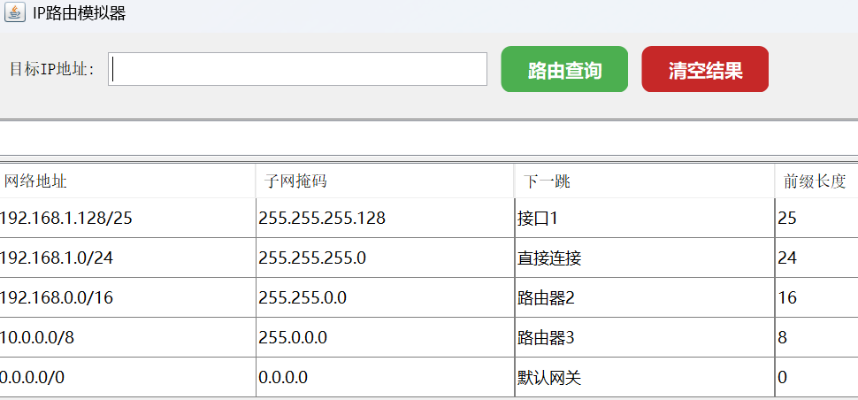
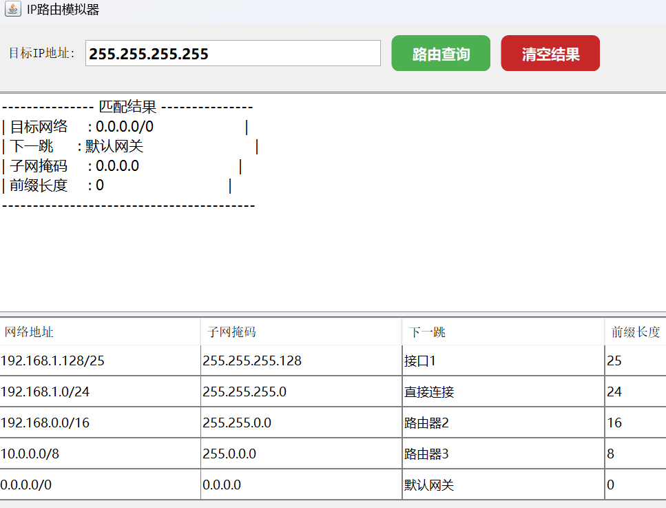

# IP路由模拟系统 🌐

> 基于Java Swing的轻量级路由模拟器，演示IP路由匹配过程

## ✨ 功能特性

- 🎯 **智能路由查询**  
  支持IPv4格式输入，采用最长前缀匹配算法
- 📋 **路由表管理**  
  可视化展示网络地址/子网掩码/下一跳/前缀长度
- 🖥️ **教学友好界面**  
  - 浅色主题按钮设计  
  - 中文格式化结果输出  
- 🧩 **模块化设计**  
  清晰的MVC架构，便于扩展

## 🚀 快速开始

### 运行环境
- **JDK 21**
- 系统支持：Windows/macOS/Linux

### 启动方式

将NetworkIp包直接导入IDE运行Main.java

## 🏗️ 项目结构
      
      - MainApp.java           # 程序入口
      - Route.java             # 路由核心逻辑
      - IPAddress.java         # IP地址处理
      - Router.java            # 路由条目实体
      - RouterFrame.java       # 主窗口框架
      - RouterController.java  # 路由转发控制
      - InputPanel.java        # 输入面板
      - ResultPanel.java       # 输出面板
      - README.md

🎮 使用演示

启动界面

路由查询

📚 教学应用
适合讲解：

IP地址分类与子网划分

路由匹配优先级原理

🤝 参与贡献

欢迎通过以下方式改进项目：

提交Issue报告问题  
发起PR贡献代码

推荐扩展方向：

IPv6支持

动态路由协议模拟

📜 开源协议
本项目采用 MIT License
允许自由使用和修改

📧 维护者：1350747489@qq.com
🌍 项目主页：https://github.com/xuan0331/NetworkIP
